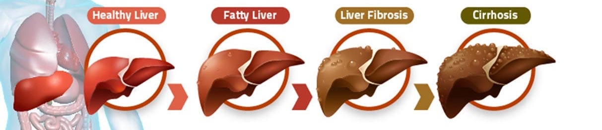
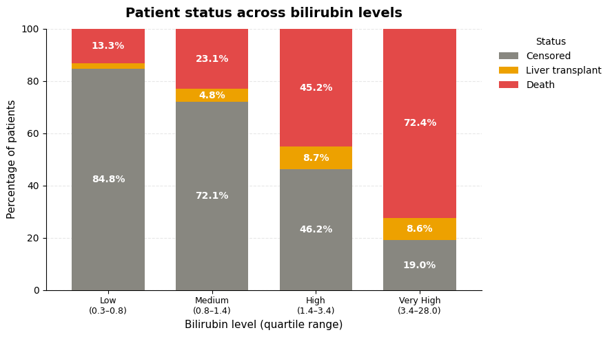
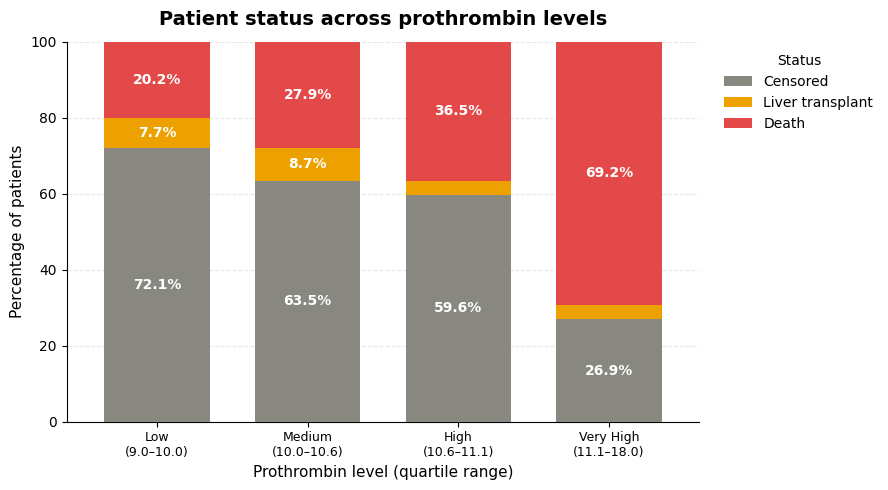
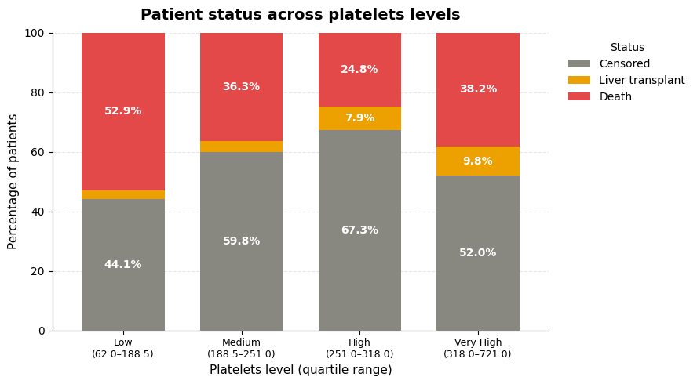
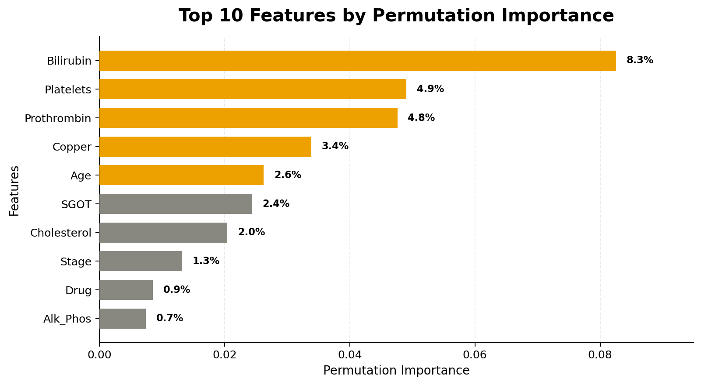
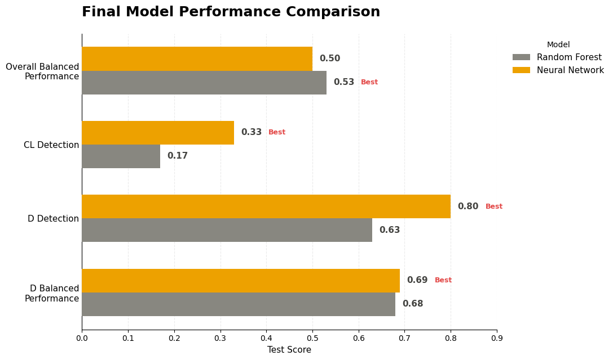

# Predicting Liver Cirrhosis Patient Outcomes to Support Earlier Clinical Intervention
## A machine learning and deep learning analysis of 418 primary biliary cirrhosis patients
**Author**: Siwar Ehwass

### Business problem:
Liver cirrhosis is chronic, progressive scarring of the liver, usually caused by long-term inflammation or damage. As scar tissue builds up, it blocks normal blood flow and stops the liver from filtering toxins, making proteins, and regulating blood clotting — damage that generally can't be reversed. This dataset tracks **primary biliary cirrhosis (PBC)**, a form where the immune system attacks the liver's bile ducts.

Patients follow very different paths: some stay stable, some need a transplant, some die. Missing a patient heading toward death (`Status` = `D`) is the costliest mistake, since it means a missed chance for earlier intervention. This project predicts patient outcome — **C** (stable), **CL** (transplant), or **D** (death) — from routine labs, so care teams can flag high-risk patients earlier. The model was optimized for **D recall** and **D F1-score** over raw accuracy, since catching death cases matters more than overall correctness.

 

### Data:
fedesoriano. (August 2021). Cirrhosis Prediction Dataset. Retrieved Jul. 12, 2026. [Dataset](https://www.kaggle.com/fedesoriano/cirrhosis-prediction-dataset).
- **418 patient records** (312 from a randomized clinical trial + 106 additional patients followed for survival), each with **19 clinical/lab features** plus the target, `Status`.
**Target Class:**
- **C (Censored / Alive)** — the patient was still alive and stable when the study ended. To a doctor, this is the "safe" group — no urgent action needed.
- **CL (Censored, Liver Transplant)** — the patient's disease got bad enough that they needed a liver transplant. This is serious, but the patient survived and got treated in time.
- **D (Death)** — the patient died from the disease. This is the outcome doctors want to prevent the most.

## Methods
- Dropped `ID`, `N_Days` (a data leakage risk, since follow-up time is only known *after* an outcome occurs).
- Imputed missing categorical values with a `"MISSING"` category and missing numerical values with the **median**.
- Ordinal encoded `Edema` and `Stage`; one-hot encoded the remaining categorical features.
- Compared **Logistic Regression**, **Random Forest**, and **Neural Network** models.
- Applied **SMOTE** for class imbalance, **KMeans** clustering for feature engineering, and **backward feature selection** to retain the most important predictors.

## Results
### Bilirubin vs. Patient Outcome

> As `Bilirubin` levels rise, so does the death rate — from **13.3%** in the lowest group to **72.4%** in the very-high group. This lines up with the clinical role of `Bilirubin` as a direct marker of liver dysfunction: when the liver stops clearing it properly, it builds up in the blood, and that buildup tracks closely with disease severity.

### Prothrombin vs. Patient Outcome

> As `Prothrombin` time increases, so does the death rate — from **20.2%** in the low group to **69.2%** in the very-high group. This matches clinical expectations: a longer `Prothrombin` time means the blood is taking longer to clot, which is a sign the liver isn't producing clotting proteins properly. That's a clear signal of liver function breaking down, so the pattern lines up with what's already known about the disease.

### Platelets vs. Patient Outcome

> As `Platelets` counts rise, death rates mostly fall — from **52.9%** in the low group down to **24.8%** in the high group. Low `Platelets` is common in liver disease because a damaged liver causes portal hypertension, which traps and lowers platelet counts, so the pattern matches known clinical behavior. One exception: the "Very High" group jumps back up to 38.2% deaths, which is likely a smaller group with a few extreme cases pulling the percentage up rather than a true reversal of the trend.

## Feature Importance

> Permutation importance confirms that `Bilirubin` and `Platelets` are the two most consistent predictors of patient outcome across every version of the model tested. After backward feature selection, `Age` moved up to the #3 spot, pushing `Prothrombin` to #4, while `Copper` — a strong early signal — dropped sharply in importance once redundant features were removed. This agreement between the model's top features and known clinical markers (bilirubin buildup, low platelet counts from portal hypertension, copper accumulation specific to this disease) is a good sanity check that the model is learning real signals.

## Model
Three model families were compared: Logistic Regression, Random Forest, and a Neural Network, each tuned and evaluated with SMOTE, class weighting, and feature selection. The final production model is a **weighted Neural Network trained on the reduced, backward-selected feature set**. It was chosen over the Random Forest because it identifies substantially more at-risk (`D`) patients, which directly serves the business goal of minimizing missed death cases — the costliest type of error in this setting.

> The Random Forest edges out on overall balanced performance (Macro F1: 0.55 vs. 0.52), but the Neural Network catches more `D` (death) cases — 73% recall vs. 68% — while matching the Random Forest on `D` F1-score and tying on `CL` detection. Since catching death cases is the priority for this project, the Neural Network's higher `D` recall outweighs its slightly lower overall balance, making it the better fit for this use case.

The Neural Network correctly identifies **73% of patients who ultimately die**, compared to 68% for the Random Forest — a meaningful gain for a use case where missing a death case is the most expensive mistake a model can make. Both models still struggle to detect the rare `CL` (transplant) class, catching only 17% of those cases, which reflects how little training data exists for that group (just 6.1% of patients).

## Recommendations
- **Deploy the model as a triage aid, not a diagnostic tool.** A predicted `D` outcome should prompt closer monitoring, earlier specialist referral, or a transplant workup discussion — not an automatic clinical decision.
- **Prioritize `Bilirubin`, `Platelets`, `Prothrombin`, and `Age` in patient review dashboards**, since these are the features the model relies on most and they line up with established clinical markers of liver dysfunction.
- **Do not rely on this model to catch `CL` (transplant) cases.** With only 17% recall on that class, transplant-track patients still need to be identified through standard clinical protocols, not this model.
- **Use the patient risk clusters uncovered during analysis** to guide follow-up intensity: the "Advanced Disease" cluster (high `Bilirubin`/`Copper`, low `Albumin`/`Platelets`, mostly `Stage` 4) warrants the closest monitoring, while the "Healthiest Group" cluster may only need routine follow-up.

## Limitations & Next Steps
- The dataset is small (418 patients) and comes from a single study conducted decades ago (1974–1984), so performance on a modern, more diverse patient population is untested.
- The `CL` class is severely underrepresented (6.1%), and no technique tried — SMOTE, class weighting, or clustering — fully solved this; more real-world `CL` cases would likely help more than further tuning.
- Next steps: validate the model on an external/more recent cirrhosis dataset, explore cost-sensitive learning specifically for the `CL` class, and pair the model with a clinician-facing explanation tool (e.g., SHAP) so care teams can see *why* a given patient was flagged.

### For further information
For the full analysis, code, and additional visualizations, see the accompanying [notebook](Cirrhosis_Prediction.ipynb) in this repository. For any additional questions, please contact **siwarehwass@gmail.com**.
